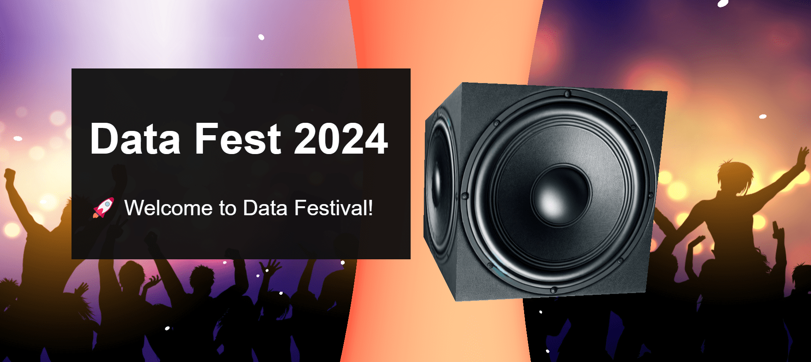
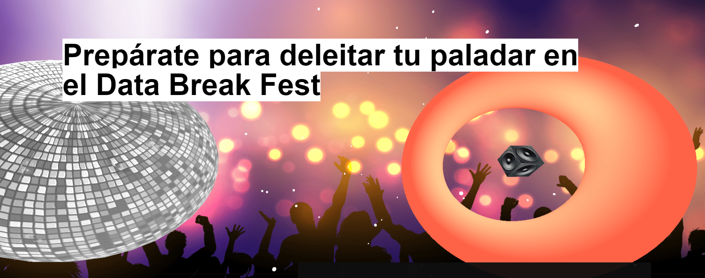
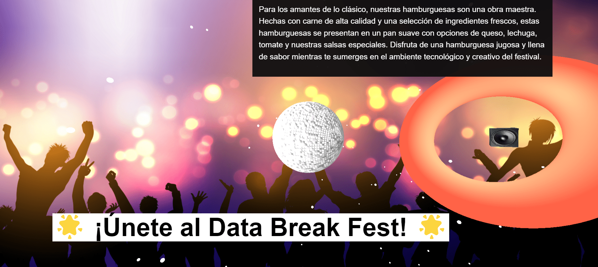

# Scrollable 3D Animation with Three.js

## Descripción

Este proyecto utiliza THREE.js para crear una experiencia interactiva en 3D que simula una fiesta. Los usuarios pueden interactuar con objetos 3D como un toroide, una bola de discoteca y un avatar, y controlar la música a través de interacciones en la interfaz.

## Funcionalidades

- **Animación de Objetos 3D**: Toroide y bola de discoteca animados que giran automáticamente.
- **Interacción con el Avatar**: Al hacer clic en el avatar, los usuarios pueden reproducir o pausar la música.
- **Fondo Interactivo**: El fondo de la escena utiliza una textura que simula un ambiente de fiesta.
- **Estrellas Aleatorias**: Generación de estrellas en posiciones aleatorias para simular un cielo nocturno.
- **Animación de Cámara**: La posición de la cámara cambia con el desplazamiento de la página para crear un efecto de movimiento.

## Capturas de Pantalla







## Prerrequisitos

Antes de empezar, asegúrate de tener instalado lo siguiente:

- [Node.js](https://nodejs.org/en/): Entorno de ejecución para JavaScript.
- Un navegador moderno capaz de ejecutar WebGL.

## Comenzando

### Instalación

Para poner en marcha el proyecto en tu máquina local para fines de desarrollo y pruebas, sigue estos pasos:

1. Clona el repositorio:
   ```
   git clone <this-repo>
   ```
2. Navega al directorio del proyecto:
   ```
   cd tu-repositorio
   ```
3. Instala las dependencias:
   ```
   npm install
   ```
4. Inicia el servidor de desarrollo:
   ```
   npm run dev
   ```
5. Abre `http://localhost:3000` en tu navegador para ver la aplicación en acción.

## Herramientas Utilizadas

- [THREE.js](https://threejs.org/)
- WebGL

## Contribuir

¡Las contribuciones son lo que hacen que la comunidad de código abierto sea un lugar increíble para aprender, inspirar y crear! Cualquier contribución que hagas será **muy apreciada**.

Si tienes una sugerencia para mejorar esto, por favor:

1. **Fork** el repositorio.
2. Crea tu **Feature Branch** (`git checkout -b feature/AmazingFeature`).
3. Haz tus **cambios** en el código.
4. **Commit** tus cambios (`git commit -m 'Add some AmazingFeature'`).
5. **Push** a la rama (`git push origin feature/AmazingFeature`).
6. Abre un **Pull Request**.

## Contacto

- **Nombre**: Marcos Damián Pool Canul
- **Correo Electrónico**: damian.marcospool@gmail.com
- **GitHub**: [marcosd59](https://github.com/marcosd59)

---

© 2024 Marcos Damián Pool Canul.
